# Session Change Map

This document maps the major technical changes made across this session, including the dead ends, pivots, and the current end state.

It intentionally omits secrets and tokens.

## Branching Paths

```mermaid
flowchart TD
    A[Start: upstream opencode-mcp-gateway review] --> B[Deployment path]
    A --> C[OAuth and transport hardening]
    A --> D[Scale-out and concurrency]
    A --> E[Runtime stabilization]
    A --> F[Workspace and session hygiene]
    A --> G[Model safety]
    A --> H[Session discovery ergonomics]
    A --> I[Docs and publishable setup]

    B --> B1[Replace Caddy-first assumptions with Cloudflare Tunnel]
    B --> B2[Create mcp1.kvcache.blog public endpoint]
    B --> B3[Shift from VPS framing to desktop-origin deployment]

    C --> C1[Smoke test OAuth metadata and token exchange]
    C --> C2[Fix Claude handshake compliance]
    C --> C3[Unique OAuth client IDs per gateway]

    D --> D1[Add mcp2 through mcp6]
    D --> D2[Concurrent agent smoke tests]

    E --> E1[Fix stalled session_create and send_message]
    E --> E2[Switch PTY I/O to websocket transport]
    E --> E3[Normalize session_delete and session tool responses]

    F --> F1[Default sessions and PTYs to /home/gabriel/AI Projects:]
    F --> F2[Mirror agents.md and AGENTS.md into workspace root]
    F --> F3[Investigate stuck Opus build-mode session]

    G --> G1[Temporary static model allowlist]
    G --> G2[Replace static allowlist with live OpenCode provider catalog]
    G --> G3[Block MiniMax highspeed variants known to fail]

    H --> H1[Add list_recent_sessions with 7-day cutoff]

    I --> I1[Rewrite README and Ubuntu guide]
    I --> I2[Add Cloudflare desktop deployment docs]
    I --> I3[Add theoretical free trycloudflare appendix]
```

## Executive Summary

The session started as a request to make `opencode-mcp-gateway` work behind Cloudflare Tunnel for OAuth, then expanded into a full desktop-origin remote MCP deployment with six public endpoints, Claude-compatible OAuth behavior, better runtime reliability, better session ergonomics, and significantly better operator documentation.

The highest-leverage changes were:

- replacing the original reverse-proxy assumptions with a Cloudflare Tunnel-first deployment model
- fixing the OAuth metadata and auth discovery path so Claude could complete the remote MCP handshake
- stabilizing the session and PTY tool paths so the gateway stopped returning empty or misleading results
- isolating multiple public gateways for concurrent agents
- defaulting sessions into the actual projects workspace and teaching the gateway to respect project rules there
- validating model switches against the live OpenCode model catalog, while explicitly blocking known-bad highspeed models
- adding a recent-session tool so agents can locate relevant work without scanning the full session history

## Phase 1: Initial Repository Conversion

Goal: take the upstream gateway and make it Cloudflare-friendly.

Key changes:

- cloned the upstream repository locally
- confirmed the code already supported externally visible URLs through `PUBLIC_BASE_URL`
- removed the original Caddy-centric framing from the docs
- added Cloudflare Tunnel templates and docs
- added `deploy/cloudflared/config.yml.example`
- added `deploy/systemd/cloudflared-opencode-mcp-gateway.service`
- updated OAuth metadata tests to stop hardcoding the original domain

Important file impact:

- `README.md`
- `deploy/cloudflared/config.yml.example`
- `deploy/systemd/cloudflared-opencode-mcp-gateway.service`
- `tests/test_oauth.py`
- `.gitignore`

Outcome:

- the repo became configurable for arbitrary public hostnames fronted by Cloudflare Tunnel

## Phase 2: OAuth Smoke Testing And Basic Runtime Fixes

Goal: verify the gateway actually boots and emits correct OAuth metadata.

Key findings:

- the repo imported `fastmcp` but did not declare it in `requirements.txt`
- the OAuth discovery endpoints were otherwise structurally sound when `PUBLIC_BASE_URL` was set

Key changes:

- added `fastmcp` to `requirements.txt`
- booted the service locally and exercised discovery, authorization, and token exchange paths

Outcome:

- local smoke tests passed for ChatGPT-style OAuth
- the gateway became bootable on a fresh environment

## Phase 3: Cloudflare Domain And Tunnel Bring-Up

Goal: create a real public OAuth endpoint under Cloudflare without using a VPS.

Key changes:

- validated the working Cloudflare token and enumerated the available zone
- selected `kvcache.blog`
- created the public hostname `mcp1.kvcache.blog`
- created a Cloudflare Tunnel and DNS route
- launched `cloudflared` locally so the desktop machine could be the origin

Outcome:

- `https://mcp1.kvcache.blog` became the first live public MCP/OAuth hostname

## Phase 4: Claude OAuth Compatibility Fixes

Goal: make Claude’s remote MCP connector handshake succeed reliably.

Root problems discovered:

- `/mcp` `401` responses did not advertise resource metadata in `WWW-Authenticate`
- protected resource metadata advertised the origin root instead of the actual MCP resource URL
- the token exchange did not validate `redirect_uri` and `resource` tightly enough
- some clients used root-resource and MCP-resource forms interchangeably

Key changes:

- added `WWW-Authenticate` with `resource_metadata` on unauthorized MCP responses
- fixed protected resource metadata to advertise `https://host/mcp`
- tightened auth-code validation for `redirect_uri` and `resource`
- kept compatibility for legacy root-resource variants where appropriate

Important file impact:

- `main.py`
- `tests/test_oauth.py`

Outcome:

- Claude-style OAuth exchange and authenticated MCP initialize succeeded against the live public endpoint

## Phase 5: Desktop-First Documentation Pass

Goal: turn the setup into something someone else could reproduce from scratch on Ubuntu.

Key changes:

- added `.env.example`
- added a full Ubuntu-from-zero setup guide
- documented OpenCode prerequisites and linked to the official OpenCode docs
- documented Cloudflare Tunnel steps, common pitfalls, and connector setup
- added the untested all-free `trycloudflare` appendix
- added maintainer contact info for `@isnotgabe` on Discord

Important file impact:

- `.env.example`
- `docs/ubuntu-cloudflare-desktop-setup.md`
- `README.md`

Outcome:

- the repo stopped being a local working tree hack and became a documented deployment path

## Phase 6: Separate Published Repo Variant

Goal: publish the Cloudflare desktop setup as a standalone repository variant.

Key changes:

- created and pushed a separate GitHub repo because GitHub would not allow a normal fork back into the same owner namespace
- rewrote the README and docs for that public-facing setup

Outcome:

- `opencode-mcp-gateway-cloudflare-desktop` became the public repo for the desktop + Cloudflare deployment variant

## Phase 7: Session And PTY Runtime Stabilization

Goal: fix the broken or misleading tool paths discovered during smoke tests.

Root problems discovered:

- `session_create` and `send_message` looked stalled because OpenCode was retrying an unsupported default model and the gateway surfaced only empty assistant placeholders
- `session_delete` had a serialization mismatch
- `bash_write` and `bash_read` were using the wrong transport because OpenCode PTYs are websocket-backed, not REST-backed

Key changes:

- changed session prompting to use `prompt_async` plus polling instead of trusting the immediate message response
- surfaced OpenCode retry status directly when the backend was retrying an unavailable model
- added default model overrides for planning and building mode
- normalized `session_delete` responses into structured dicts
- rewired PTY write/read to use the websocket PTY transport
- added PTY output buffering so `bash_read` can surface the last unread output

Important file impact:

- `session_manager.py`
- `opencode_client.py`
- `pty_manager.py`
- `tests/test_opencode_client.py`
- `tests/test_session_manager.py`
- `tests/test_pty_manager.py`

Outcome:

- the previously stalled tool paths became usable
- later smoke tests confirmed `20/20` tools working on the live deployment

## Phase 8: Multi-Gateway Scale-Out

Goal: support concurrent chatbot-controlled agents without funneling everything through one public endpoint.

Key changes:

- created `mcp2` through `mcp6`
- wired Cloudflare DNS and tunnel ingress for all six hostnames
- created per-instance env files and launcher flow
- assigned separate gateway ports `3001` through `3006`
- generated separate auth secrets for each gateway

Outcome:

- six distinct public MCP endpoints were brought online

## Phase 9: Unique OAuth Client IDs Per Gateway

Goal: prevent connector credential collisions between gateways.

Problem discovered:

- all gateways originally advertised the same OAuth client ID, which made it likely that one client would reuse another gateway’s cached credentials

Key changes:

- gave `mcp2` through `mcp6` unique client IDs
- updated the desktop auth reference file to reflect the new per-gateway IDs

Outcome:

- `mcp2` authentication failures traced to client ID reuse were resolved

## Phase 10: Workspace Defaulting And AGENTS Rules

Goal: make new sessions start in the real projects workspace and follow workspace-local rules.

Key findings:

- the actual projects root on this machine is `/home/gabriel/AI Projects:` with a trailing colon
- OpenCode ignored session `directory` when the gateway sent it in the JSON body
- OpenCode expects session `directory` as a query parameter on `/session`

Key changes:

- added `DEFAULT_WORKSPACE_DIR`
- defaulted new sessions to `/home/gabriel/AI Projects:` unless a directory is explicitly provided
- defaulted raw shell fallback sessions there too
- defaulted PTYs there as well
- fixed `opencode_client.create_session()` to send `directory` as a query parameter instead of JSON
- added workspace-local `agents.md` and `AGENTS.md` files to `/home/gabriel/AI Projects:`

Outcome:

- new sessions and PTYs now start in the projects workspace
- OpenCode can see workspace-local agent instructions there

## Phase 11: Model Safety Policy Evolution

This area changed several times and is the clearest branching example in the session.

### Path A: No validation

- initially `switch_model` accepted anything
- this let agents switch to values that did not work under the current harness or provider entitlements

### Path B: Temporary fixed allowlist

- briefly restricted `switch_model` to three manually verified models
- this solved the immediate issue but was too narrow because the valid model set already existed inside OpenCode itself

### Path C: Live OpenCode catalog validation

- replaced the narrow fixed allowlist with validation against `GET /config/providers`
- accepted any `provider/model` pair that OpenCode currently exposed as active
- rejected anything not present in that catalog

### Path D: Explicit blocked-model overlay

- after manual confirmation that the MiniMax highspeed variants failed, added a blocked-model filter on top of the live catalog
- explicitly blocked:
  - `minimax-coding-plan/MiniMax-M2.5-highspeed`
  - `minimax-coding-plan/MiniMax-M2.7-highspeed`

Current model policy:

- allowed: live OpenCode catalog entries
- blocked: the two known-bad MiniMax highspeed models above

Outcome:

- `switch_model` is now much safer without being artificially narrow

## Phase 12: Concurrent Agent Validation

Goal: check whether six gateways could actually be used concurrently.

Key changes:

- ran six independent MCP clients against `mcp1` through `mcp6`
- switched them to `minimax-coding-plan/MiniMax-M2.7`
- executed bash-backed tasks that created per-gateway artifacts in `/tmp`

Findings:

- all six gateways could execute work concurrently
- final textual completion under heavy MiniMax tool-calling load could be slightly delayed relative to tool completion
- `read_session_logs` and artifact existence confirmed successful completion across all six

Outcome:

- the six-gateway architecture is viable for concurrent agent work

## Phase 13: Session Discovery Ergonomics

Goal: make it easier for agents to find relevant recent sessions without paging through everything.

Key changes:

- added `list_recent_sessions(limit=10, days=7)`
- sorts by most recent activity first
- filters to sessions active within the last N days
- uses the newer of backend `updated` and gateway `last_used`

Important file impact:

- `session_manager.py`
- `main.py`
- `tests/test_session_manager.py`

Outcome:

- agents now have a dedicated recent-session discovery path optimized for the last week of work

## Notable Investigations And Pivots

### Stuck Opus Build-Mode Session

Session inspected: `ses_2c347fc9effelABT8J93Q0pHCB`

What happened:

- the planner completed its research phase normally
- the later build-mode turn never produced a new assistant turn
- there were no pending questions, no pending permissions, and no retry status
- the gateway mode switch itself was not the issue
- the session had been switched to an invalid model by the agent

Outcome:

- this directly motivated stronger `switch_model` validation

### Session Root Not Honored

What looked wrong:

- PTYs respected the desired workspace root
- sessions still landed in `/home/gabriel`

Root cause:

- the gateway passed `directory` in the JSON body
- OpenCode expects it as a query parameter

Outcome:

- fixing the request shape made session roots work as expected

## Current End State

At the end of this session, the gateway stack has the following properties:

- Cloudflare Tunnel-based public deployment
- desktop-origin, no-VPS architecture
- six public MCP endpoints
- Claude-compatible OAuth handshake behavior
- per-gateway client ID separation
- stable PTY I/O over websocket
- stable session prompting via `prompt_async` polling
- explicit surfaced backend retry errors for unsupported models
- workspace-local session defaults under `/home/gabriel/AI Projects:`
- workspace-local agent rule files under the projects root
- `switch_model` validated against the live OpenCode catalog with two known-bad highspeed MiniMax models blocked
- recent-session discovery tool for the last 7 days
- rewritten installation and troubleshooting docs

## Key Files Touched

Core runtime:

- `main.py`
- `session_manager.py`
- `opencode_client.py`
- `pty_manager.py`

Tests:

- `tests/test_oauth.py`
- `tests/test_opencode_client.py`
- `tests/test_session_manager.py`
- `tests/test_pty_manager.py`
- `tests/conftest.py`

Deployment and docs:

- `README.md`
- `docs/ubuntu-cloudflare-desktop-setup.md`
- `docs/session-change-map.md`
- `.env.example`
- `deploy/cloudflared/config.yml.example`
- `deploy/systemd/cloudflared-opencode-mcp-gateway.service`
- `scripts/run-local-cloudflare-tunnel.sh`
- `scripts/run-gateway-instance.sh`
- `.gitignore`

Local machine state created during the session:

- `.env`
- `.env.mcp2`
- `.env.mcp3`
- `.env.mcp4`
- `.env.mcp5`
- `.env.mcp6`
- `/home/gabriel/Desktop/mcp_auth.md`
- `/home/gabriel/AI Projects:/agents.md`
- `/home/gabriel/AI Projects:/AGENTS.md`

## Practical Reading Order

If you are trying to understand the final system, read these in order:

1. `README.md`
2. `docs/ubuntu-cloudflare-desktop-setup.md`
3. `main.py`
4. `session_manager.py`
5. `opencode_client.py`
6. `pty_manager.py`

If you are trying to understand why the system is shaped this way, read this file after the README.
